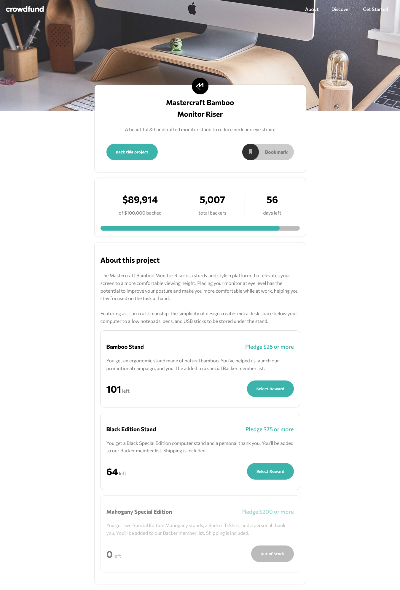

# Frontend Mentor - Crowdfunding product page solution

This is a solution to the [Crowdfunding product page challenge on Frontend Mentor](https://www.frontendmentor.io/challenges/crowdfunding-product-page-7uvcZe7ZR). Frontend Mentor challenges help you improve your coding skills by building realistic projects.

## Table of contents

- [Overview](#overview)
  - [The challenge](#the-challenge)
  - [Screenshot](#screenshot)
- [My process](#my-process)
  - [Built with](#built-with)
  - [What I learned](#what-i-learned)
  - [Continued development](#continued-development)

## Overview

### The challenge

Users should be able to:

- View the optimal layout depending on their device's screen size
- See hover states for interactive elements
- Make a selection of which pledge to make
- See an updated progress bar and total money raised based on their pledge total after confirming a pledge
- See the number of total backers increment by one after confirming a pledge
- Toggle whether or not the product is bookmarked

### Screenshot

## My process

### Built with

- Semantic HTML5 markup
- CSS custom properties
- Flexbox
- Mobile-first workflow
- Vanilla JS, CSS

### What I learned

This project had some interesting positioning challenges. In particular, placing the cards near the bottom of the header image was difficult since the header image was responsive. My initial attempts made it so that the cards did not move in reponse to the size of the image growing or shrinking. Though the solution was just to wrap the cards in an absolutely positioned div inside of a relatively positioned container with the header image inside of it.

### Continued development

This project showed me some ways that frameworks can help with the development process. For example, if I wanted to add an extra reward to the list using a framework like React would mean I could just add it as a component with all its functionality built in. Whereas with vanilla JS I tried to make the functions controlling the behavior associated with the rewards as abstract as I could so that adding a new reward would not break the site. However, they way I developed this functionality relies on the fact that the cards are positioned in a specific order.
